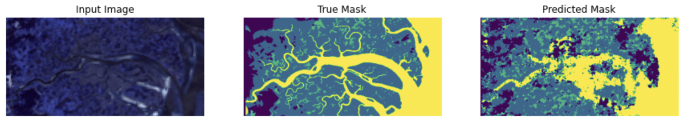
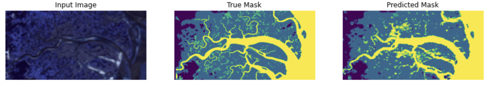

# MarshBoundaries
Using aerial marsh photos to determine boundaries between land and water

Work in progress. Goal is to produce this:

from this:

While a large annotated image can be viewed as many data points, the main challenge is still the scarcity of labeled data.

## Deep network using patches as data points and only predicting boundary.

So far we are just using small patches as data points and inferring as follows:

The training image is the top half, and as you can see the network generalizes poorly to the bottom half. Next steps are to use a mask which labels marsh/nonmarsh etc, not just the boundary. Also we can augment and obtain more data. Finally we can try a model with fewer trainable parameters, as the test images look good enough to indicate overfitting.

## Deep network with 4 class mask.

Here's with the 4 class mask, and not using patches. The patches were unnecessary because the CNN is resizeable and each image actually functions as many data points. However it's still pretty bad.

## Shallow network with 4 class mask

This architecture just has a depth 2 encoder and decoder. This is a vast improvement in efficiency and accuracy over the deep network. In order to distinguish ponds from water we used some dilated convolutions, but as you can see, identifying ponds is still a struggle.

