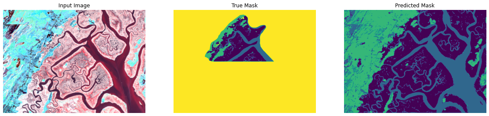

# MarshBoundaries
Using aerial marsh photos to determine boundaries between land and water

Work in progress. Goal is to produce this:


from this:


While a large annotated image can be viewed as many data points, the main challenge is still the scarcity of labeled data.

## Deep network using patches as data points and only predicting boundary.

So far we are just using small patches as data points and inferring as follows:


The training image is the top half, and as you can see the network generalizes poorly to the bottom half. Next steps are to use a mask which labels marsh/nonmarsh etc, not just the boundary. Also we can augment and obtain more data. Finally we can try a model with fewer trainable parameters, as the test images look good enough to indicate overfitting.

## Deep network with 4 class mask.

Here's with the 4 class mask, and not using patches. The patches were unnecessary because the CNN is resizeable and each image actually functions as many data points. However it's still pretty bad.


## Shallow network with 4 class mask

This architecture just has a depth 2 encoder and decoder. This is a vast improvement in efficiency and accuracy over the deep network. In order to distinguish ponds from water we used some dilated convolutions, but as you can see, identifying ponds is still a struggle.


## Shallow network with maxpooling 

A very shallow u-net architecture preduces pretty good results, an 89 percent training error and 87 percent validation error for our weighted metric (error on each class is inversely weighted by its frequency).

We only did this prediction on GCE and VCR.



## Behavior on a new marsh 

Here's the behavior on PIE after being trained only on GCE and VCR: 


and the true mask:


It appears to confuse marsh for upland and upland for water. There's still much room for improvement. Also need to encourage some connectivity in the channels. 


## More ideas 

1. We still get many checkerboard artifacts. I would hope that a more expressive model could eliminate these at the expense of overfitting, but 89 percent is the highest training error so far even with deeper nets. Before regularizing we at least need to overfit!
2. Augment - again, we first need to overfit. Also, the input image is much lower resolution than the mask. This maybe makes it less surprising that it's hard to overfit, because we are doing a kind of super-resolution at the same time. *Done: random rotations,zooms,flips.*
3. Do some interpolation to the input images to get rid of the pixelation, resulting in a Gaussian blur of the true image rather than a pixelation. I want this because pixelated images are in some sense not invariant to rotations other than 90 degrees.  
4. Again - not robust to rotations. I realize now that the GCE and VCR inputs are slightly rotated, but PIE is not! This makes the checkerboard even worse in that case. 
5. Use greyscale input data instead of grey to jpg to grey again. Try augmenting colors.


# HOW TO USE

So far produces weird results on different sized images, and is only usable for prediction. I will add usable code to train the model later.

Nonetheless, you can simply clone this repository, install necessary dependencies for PredictFromSaved.py and then run 

```
python PredictFromSaved.py
```

in your command line. Or, if you'd prefer, just fire up the jupyter notebook MarshBoundaryDemo.ipynb. 


